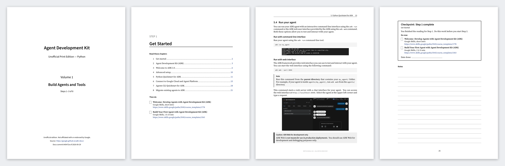

# ADK Print Edition (unofficial)

The Google [Agent Development Kit (ADK)](https://google.github.io/adk-docs/) documentation as printable PDF books, one edition for each SDK language: Python, Go, TypeScript, and Java. Each edition shows code in its own language only. The books follow a read-then-do schedule: you read the chapters for a step, then you do the matching Google Skills course or codelab.

A GitHub Action rebuilds the PDFs every week from the newest [google/adk-docs](https://github.com/google/adk-docs) commit.



## Download

Get the PDFs from the [latest release](https://github.com/DevDizzle/adk-print-edition/releases/latest). Each edition has three volumes:

| Edition | Vol. 1: Build Agents and Tools (steps 1–3) | Vol. 2: Context, Workflows, and Components (steps 4–6) | Vol. 3: Run, Evaluate, and Deploy (steps 7–8) |
|---|---|---|---|
| **Python** | [PDF](https://github.com/DevDizzle/adk-print-edition/releases/latest/download/ADK-Print-Edition-Python-Vol1-Build-Agents-and-Tools.pdf) | [PDF](https://github.com/DevDizzle/adk-print-edition/releases/latest/download/ADK-Print-Edition-Python-Vol2-Context-Workflows-Components.pdf) | [PDF](https://github.com/DevDizzle/adk-print-edition/releases/latest/download/ADK-Print-Edition-Python-Vol3-Run-Evaluate-Deploy.pdf) |
| **Go** | [PDF](https://github.com/DevDizzle/adk-print-edition/releases/latest/download/ADK-Print-Edition-Go-Vol1-Build-Agents-and-Tools.pdf) | [PDF](https://github.com/DevDizzle/adk-print-edition/releases/latest/download/ADK-Print-Edition-Go-Vol2-Context-Workflows-Components.pdf) | [PDF](https://github.com/DevDizzle/adk-print-edition/releases/latest/download/ADK-Print-Edition-Go-Vol3-Run-Evaluate-Deploy.pdf) |
| **TypeScript** | [PDF](https://github.com/DevDizzle/adk-print-edition/releases/latest/download/ADK-Print-Edition-TypeScript-Vol1-Build-Agents-and-Tools.pdf) | [PDF](https://github.com/DevDizzle/adk-print-edition/releases/latest/download/ADK-Print-Edition-TypeScript-Vol2-Context-Workflows-Components.pdf) | [PDF](https://github.com/DevDizzle/adk-print-edition/releases/latest/download/ADK-Print-Edition-TypeScript-Vol3-Run-Evaluate-Deploy.pdf) |
| **Java** | [PDF](https://github.com/DevDizzle/adk-print-edition/releases/latest/download/ADK-Print-Edition-Java-Vol1-Build-Agents-and-Tools.pdf) | [PDF](https://github.com/DevDizzle/adk-print-edition/releases/latest/download/ADK-Print-Edition-Java-Vol2-Context-Workflows-Components.pdf) | [PDF](https://github.com/DevDizzle/adk-print-edition/releases/latest/download/ADK-Print-Edition-Java-Vol3-Run-Evaluate-Deploy.pdf) |

The page size is US Letter. Print on both sides of the paper.

## What is in the books

- **One language per edition.** The docs show each example in Python, TypeScript, Go, Java, and Kotlin. Each edition keeps its own language and removes the other tabs. It also leaves out the pages and sections that apply only to other languages.
- **A schedule at the front.** Eight steps, each with its reading and its course. Each step has a box to tick when you finish it.
- **Step pages.** Each step starts with its chapter list and page numbers. Each step ends with a checkpoint page: the course links, a "date done" line, and ruled lines for notes.
- **Page references.** A link in the docs becomes "(p. 42)" in the same volume, or "(Vol. 2, ch. 31)" for another volume.
- **Made for a monochrome laser printer.** Notes and code use gray fills, not color. Long code lines wrap with a ↪ marker.
- **Diagrams.** Mermaid diagrams and SVG images are rendered to images.

## The schedule

| Step | Read | Then do |
|---|---|---|
| 1 | Get Started (Vol. 1) | [Welcome: Develop Agents with ADK](https://www.skills.google/paths/3545/course_templates/1778), [Build Your First Agent with ADK](https://www.skills.google/paths/3545/course_templates/1563) |
| 2 | Agents and Models (Vol. 1) | [Build Agents with ADK](https://www.skills.google/paths/3545/course_templates/1585) |
| 3 | Tools (Vol. 1) | [ADK Crash Course](https://codelabs.developers.google.com/onramp/instructions), sessions 1–3 |
| 4 | Context, Sessions, State, and Memory (Vol. 2) | [Manage Agent Memory and State](https://www.skills.google/paths/3545/course_templates/1584), crash course session 4 |
| 5 | Multi-Agent and Graph Workflows (Vol. 2) | Crash course sessions 5–8 |
| 6 | Callbacks, Plugins, Artifacts, and Safety (Vol. 2) | [Engineer AI Agents with ADK](https://www.skills.google/paths/3545/course_templates/1596) (skill badge) |
| 7 | Runtime, Observability, and Evaluation (Vol. 3) | Hands-on: write an eval set and run it with `adk eval` |
| 8 | Deployment and A2A (Vol. 3) | [Deploy Production Ready Agents](https://www.skills.google/paths/3802) (skill badge), [Wrap Up](https://www.skills.google/paths/3545/course_templates/1771) |
| App. | Live and Voice Agents (Vol. 3) | Optional |

Do one step each week. Then you complete the books and the courses in about eight weeks. The courses can use older product names than the docs. For example, a lab can say "Vertex AI Agent Engine" where the docs say "Agent Runtime".

The Google Skills labs and the codelab use Python. In the Go, TypeScript, and Java editions, do the labs in Python, or port the lab code to your language as extra practice.

## How the build works

`volumes.yml` is the book plan: the volumes, the steps, the page order, and the course for each step. Its `editions` section swaps a page for a language's own version, for example the Go quickstart. The build leaves out a page when its support tag omits the edition language, or when the page has code only in other languages. `build/build.py` reads each MkDocs page and makes these changes:

1. Replaces each `--8<--` snippet include with the code file that it points to.
2. Keeps the tab for the edition language in each code tab group and removes the other language tabs. It also removes sections whose heading names only another language, for example "ADK Go 1.x compatibility".
3. Changes admonitions (`!!! note`, `??? tip`) into boxes.
4. Changes links between pages into page references, and web-only markup (icons, card grids, video embeds) into plain text.
5. Renders Mermaid and SVG diagrams to PNG with headless Chrome.

Then pandoc (with `build/filters.lua`) makes LaTeX, and xelatex makes the PDFs. `build/preamble.tex` sets the page layout. `build/qa.py` scans the PDFs for markup that the conversion missed and for text that runs off a page.

The converter is not specific to ADK. With a new `volumes.yml`, it can possibly work for other MkDocs Material sites. It has been tested on the ADK docs only.

## Build it yourself

You need Python 3.10 or later, Node.js 18 or later, pandoc 3, TeX Live or [TinyTeX](https://yihui.org/tinytex/), and Chrome or Chromium.

```bash
pip install -r requirements.txt
PUPPETEER_SKIP_DOWNLOAD=1 npm ci --prefix tools
tlmgr install $(cat build/tex-packages.txt)

python build/build.py                # Python edition; clones google/adk-docs into src/ on the first run
python build/build.py --lang go      # one edition: python, go, typescript, or java
python build/build.py --lang all     # all four editions
python build/build.py --pull         # gets the newest docs first
python build/build.py --vol 2        # builds one volume
python build/qa.py                   # checks the PDFs in dist/
```

If the build cannot find your browser, set `CHROME_PATH` to the Chrome or Chromium executable.

## Known gaps

- Step 7 has no matching course, so it has a hands-on task.
- The Go, TypeScript, and Java editions are shorter than the Python edition, because the docs cover fewer features in those languages. For example, the docs have no evaluation or live-streaming pages for Go and TypeScript yet. A step page says so when a language has no chapters for that step.
- There is no Kotlin edition yet. The docs have about 40% as many Kotlin examples as Python examples.
- Some pages are not in the books: the local-model pages (Gemma, Ollama, vLLM, LiteRT-LM, Apigee), the API reference, the integrations catalog, the community pages, and the release notes.
- If the source docs have an error, the books show the same error.

## License

- The build scripts in this repository are under the [Apache License 2.0](LICENSE).
- The ADK documentation is © Google and is under the [Apache License 2.0](https://github.com/google/adk-docs/blob/main/LICENSE). Each PDF includes the license text and a statement of the changes made.
- This project is not affiliated with, sponsored by, or endorsed by Google. Google is a trademark of Google LLC.
